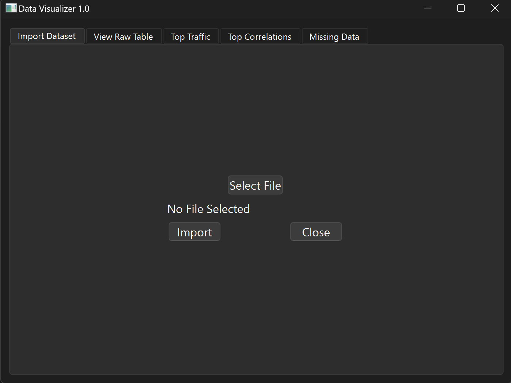

# Overview

This is a tool for visualizing network traffic datasets during the machine learning process.
Designed to work with data from the dataset found at:
https://www.kaggle.com/datasets/agungpambudi/network-malware-detection-connection-analysis?resource=download

# How To Run

1. Ensure python3 is properly installed and added to PATH

2. Clone the repo to a folder on your machine

3. Update & Install Dependencies  
    - `python.exe -m pip install --upgrade pip`
    - `pip install -r requirements.txt`

4. Download a [Compatible Dataset](https://www.kaggle.com/datasets/agungpambudi/network-malware-detection-connection-analysis?resource=download) to the repo folder

5. Run the script (depends on how python3 is installed)
    - `python3 main.py`  
    **OR**
    - `py main.py`  

# Description

This tool is designed to allow a data researcher to quicky identify key trends in data without needing to do a lot of preprocessing on their own.

## Instructions:

To begin using the tool, run main.py with the latest version of Python3.

You should see a window that looks similar to this:

### Import Dataset

To import the dataset you will be working with, select **Select File** and a file explorer window will open.
Navigate to where your dataset is and select the file you intend to use.

Once selected and after verifying the path is complete, select **Import** and the dataset will be imported.

### View Raw Table

This tab allows you to view the raw dataset without opening it in another window. Scroll bars are available to navigate up/down and left/right with columns being labeled with their respective category.

### Top Traffic

This tab allows you to quickyly view stats about the most frequently occurring Source/Destination IPs and Ports.

Select an option from the dropdown menu and click **Update Selection** to populate the field.

### Top Correlations

### Missing Data

